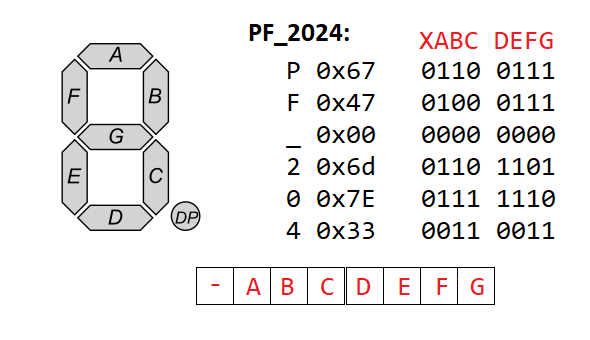

``` 
Vysoké učení technické v Brně
Fakulta informačních technologií
Michal Balogh (xbalog06)
2024
```

## Mikroprocesorové a vstavané systémy


# Rozpoznávanie znakovej abecedy a zobrazovanie na 7-segmentovom displeji typu flipdot


## Úvod

Zadanim bolo využiť zaujímavý typ elektromechanickeho displeja typu
flip-dots a demonštrovať jeho využitie. Na vypracovanie som mal k
dispozici displej s rozmermi 4 riadky, kazdy po 7 znakov. Zakladnym
zadanim bolo zobrazenie jednoduchých správ a meranej teploty a vlhkosti.
Po splneni tohto zadania, som vytvoril neuronovu siet, ktora rozoznava
pismena znakovej abecedy. Tieto data su potom zobrazovane na displej.

## Riešenie Projektu
Ako funguje projekt, mozno vidiet na tomto videu:
[](https://www.youtube.com/watch?v=IdzLrns7vJk)

## Vybavenie

### 7-segmentovy displej typu flip-dots

S displejom sa da komunikovat pomocou prevodníku RS-485, rychlostou
57600 baudov. Znaky na displeji sa nedaju nastavit jednotlivo, ale naraz
pomocou datoveho ramcu, ktory specifikuje vyrobca[^1]:
```
+-------+----------+---------+----------------+-------+
| 0x80  | Command  | Address |      Data      | 0x8F  |
+-------+----------+---------+----------------+-------+
```


Na zaciatku je hlavicka `0x80`. `Command` specifikuje, ktory typ
displeja bude prijmat datovy ramec. Pre tip displeja, s ktorym som
pracoval (4x7) je prikaz `0x83` - posiela 28 Byteov dat a refreshne
displej. Refresh znamena, ze data sa rovno zobrazia na displeji. Adresu
pouzivam `0xFF` - cize broadcast. Data su o velkosti 4x7 Byteov. Jeden
Byte predstavuje 7 segmentov. Na konci je este pata `0x8F`.

Nastavenie jedneho znaku je dane siedmimi bitmi. Na obrazku mozme
vidiet, ktore bity nastavuju ktore segmenty, a priklad, ako napriklad
nastavit napis `PF 2024`.


*Obr. 1: Kódovanie segmentov* {#fig:7seg} 

Na displeji nie je desatinna bodka a teda MSB je ignorovany a mal by byt
nastaveny na 0.

### Kombinovany senzor na teplotu a vlhkost DHT11

Senzor DHT11 je jednoduchý kombinovaný senzor, ktorý meria teplotu v
rozsahu 0 -- 50 stupňov Celzia s presnosťou ±1 °C a vlhkosť v rozmedzí
20 -- 90% s presnosťou ±4%. Existuje senzor DHT22 podobného druhu, ktorý
by sa dal využiť na presnejšie merania, ale ja som mal k dispozícii
tento.

Senzor má štyri vývody, z toho jeden je nezapojený, dva sú použité na
napájanie v rozsahu 3V až 5V a jeden je dátový.[^2]

{#fig:dht11 width="50%"}

### Prevodnik RS485

Pre komunikáciu s 7-segmentovým displejom je použitý prevodník RS-485.
Je to prevodnik linky UART na seriovu linku RS485. Linka je
poloduplexna. [^3] Linke treba okrem rychlosti na 57600 baudov, treba
nastavit aj dalsie parametre: vypnut paritny bit, nastavit jeden stop
bit, a nastavit 8 bitov na jeden Byte. V jazyku C sa to dat nastavit
takto (kniznica `termios.h`):

```c
tty.c_cflag &= PARENB; 
tty.c_cflag &= CSTOPB;
tty.c_cflag &= CSIZE;
tty.c_cflag |= CS8;
```

Tento kód je implementovaný vo variante riešenia číslo 1, v súbore:
`
./rpi4_py_c/serial_com_c/src/serial.c
`

## Varianty riesenia

Postupne som skusal rozne riesenia, a skoncil som s troma roznymi
variantami:

-   Varianta 1: rpi4 C+Python

-   Varianta 2: rpi4 Python

-   Varianta 3: esp8266 C+Python

## Varianta 1: rpi4 C+Python {#var1}

Implemtnacna platforma pre tuto variantu je Raspberry Pi 4. Cela
implementacia varianty 1 je v priecinku `rpi4_py_c`. S touto variantou som zacal, a
zacal som tym, ze som nastavil seriovu komunikaciu s displejom, vytvoril
funkcie na vytvorenie spravy a nastavovanie jedntolivych znakov pomocou
indexovania do 2D pola displeja (4x7) a mapovania na konstante
definovane symboly (viz. obr [1](#fig:7seg)). Vytvoril som si par prikladov (examples.c), kde
sa posielali konstantne spravy, a na nich som otestoval funkcnost
pripojenia na displej a spravny format datoveho ramca spravy.

Druha cast tejto varianty je implementovana v Pythone.
Najprv som vytvoril dataset pre rozpoznavanie
znakovej reci. Vyuzil som ASL dataset a modul Hands z
frameworku Mediapipe. Pommocou skriptu `train\reduce_dataset.py`som zredukoval 
pocet obrazkov pre triedu v dataset na 200. Potom pomocou modulu Hands, 
som z obrazkov datasetu extrahoval orientacne body z ruk.
Konkretne 21 bodov v 3D priestore a tie som ulozil do csv suboru s 64
stlpcami: 1 oznacenie znaku a 21\*3 (x,y,z) suradnic. Vytvorenie
datasetu je v subore `train/create_hand_landmarks_dataset.py`. V subore
`train/ASL_handm_landmarks_dataset.py` je vytvorena pytorch Dataset trieda
ASLLandmarkDataset. samotny model je v subore `train/gesture_recognition_model` 
a trenovaci skript je v subore `train/train.py`.  

Natrenovany model je pouzity na inferenciu v skripte `rpi4_py_c/gesture_recognizer_py/main.py`.
Tento skript nacita model, otvori kameru, a pomocou modulu Hands z Mediapipe, ziska orientacne body ruky.
Tieto body su potom pouzite na predikciu znaku.
Tento skript komunikuje s programom v C cez socket. `gesture_recognizer` posiela 
predikovane znaky cez socket na program v C `serial_com_c`, ktory posiela znaky na displej. 
`gesture_recognizer` taktiez visualizuje znaky a obraz kamery.

Program treba spustit v dvoch terminaloch. V jednom treba spustit `main.py` a v druhom `main.c`.


## Varianta 2: rpi4 Python

V tejto variante bezi cely program v Pythone na Raspberry Pi 4. Cely program je v priecinku `rpi4_py` 
a da sa spustit pomocou skriptu `main.py`. Tento skript podobne ako vo variante 1 nacita natrenovany model, otvori kameru a nastavi seriovu komunikaciu s displejom. Jediny rozdiel je, ze data neposiela cez socket, ale priamo cez seriovu linku do displeja.

## Varianta 3: esp8266 C+Python - Finalna varianta

Posledna varianta je implementovana na platforme ESP8266. Implementaciu je mozne najst v priecinku `esp8266`.
Tato varianta je rozdelena na dve casti. Prva cast je `server_gestures` implementovana v Arduine. Tato cast sluzi ako server. 
Pomocou wifi modulu sa pripoji do siete a caka na data od klienta na urcitej IP adrese a porte. Data od klienta posiela na seriovu linku a tie sa zobrazuju na displeji. Seriova linka je pripojena na prevodinka RS845 na datovych pinoch D2 (TX) a D3 (RX). Velkou vyhodou tejto varianty je, ze klient je uplne nezavisly od servera a moze byt implementovany na akejkolvek platforme a posielat v podsate hocijake data. V mojom pripade som uz vyuzil natrenovany model na rozpoznavanie znakov a posielal som predikovane znaky na server. Ale klient sa da vymenit za hocijaky iny program, ktory bude posielat znaky na server a ten ich bude zobrazovat na displeji. Okrem toho, v tejto variante je upraveny beh programu na ESP8266. Po pripojeni do siete sa vypise animovana uvitacia sprava "HELLO". Nasledne sa moze program dostat do dvoch stavov: stav IDLE a stav CONNECTED. Zacina v stave IDLE a caka na pripojenie zariadenia na konkretny port. V tomto stave zobrazuje na displeji cas, teplotu a vlhkost. Teplotu a vlhkost ziskava zo senzoru DHT11. Senzor je zapojeny do datoveho pinu D5. Po pripojeni zariadenia sa prejde do stavu CONNECTED, ktore je singalizovane blikajucim kurzorom a zacne prijimat data od klienta a zobrazovat ich na displeji. Po ukonceni spojenia prejde zase do stavu IDLE.


## Zaver

Projekt bol narocny na vypracovanie, ale kedze bol velmi zaujimavy, islo to dobre. Najzlozitejsou castou bolo vymyslenie struktury programu - komunikacie medzi jednotlivymi castami. Najspokojnejsi som s poslednou variantou, kde je spracovanie dat velmi flexibilne a displej sa da vyuzit na zobrazovanie hocijakeho textu aj v inych projektoch.
Okrem toho dalsiou zlozitejsou castou obolo nastavenie seriovej komunikacie s displejom a vytvorenie datoveho ramca podla specifikacie. Na projekte som stravil vyse 40 hodin. 

Autoevaluacia: 
- E: 2b - kedze zadanie som si vymyslel sam, chcel som ho dotiahnut do stavu, ktory sa mi bude pacit, a preto som aj vytvoril 3 rozne varianty
- F: 5b - hlavne posledna varianta splna vsetky poziadavky zadania, a okrem toho ma rozne bonusy, ako napriklad zaujimave animacie
- Q: 2b 
    - uzivatelska privetivost: uzivatel sa moze pripojit bud so svojim programom a na jednoduche rozhranie posielat znaky na displej, alebo moze pouzit moj program na rozpoznavanie znakov a posielat predikovane znaky na displej, ktore aj vidi na obrazovke kde sa zobrazuje vystup 
    - sposob implementacie: implementacia je rozdelena na dve casti, server a klient, ktore su nezavisle a komunikacia medzi nimi prebieha cez wifi
- D: 3b 
    - Uvod do probemu: Myslim si, ze jasne popisujem, co je cielom projektu
    - Popis riesenia: Do detailu popisujem vsetky 3 varianty a ich implementaciu
    - Zhodnotenie: Zhodnotenie je podrobne a obsahuje vsetky potrebne casti
- P: 2b
    - Verim, ze projekt odprezentujem dobre :), a prezentacia projektu samotneho je pekna vizualna, interaktivna a zaujimava
- SUM: 14b

## Zdroje:
https://arduinoposlovensky.sk/projekty/dht11-a-dht22/
https://techfun.sk/produkt/rs485-prevodnik-s-cipom-max485esa/
https://papouch.com/prevodniky/rs485/

https://learn.microsoft.com/en-us/windows/wsl/connect-usb
https://blog.mbedded.ninja/programming/operating-systems/linux/linux-serial-ports-using-c-cpp/
https://www.kaggle.com/datasets/grassknoted/asl-alphabet?select=asl_alphabet_test 

@misc{https://www.kaggle.com/grassknoted/aslalphabet_akash nagaraj_2018,
title={ASL Alphabet},
url={https://www.kaggle.com/dsv/29550},
DOI={10.34740/KAGGLE/DSV/29550},

# Arduino
https://docs.arduino.cc/retired/library-examples/wifi-library/UdpNtpClient/
https://randomnerdtutorials.com/getting-started-with-esp8266-wifi-transceiver-review/
https://randomnerdtutorials.com/esp32-ntp-client-date-time-arduino-ide/

[^1]: <https://cdck-file-uploads-europe1.s3.dualstack.eu-west-1.amazonaws.com/arduino/original/4X/3/5/2/352c3c32d1ddcd251f45966920b16b53f3214f32.pdf>

[^2]: <https://arduinoposlovensky.sk/projekty/dht11-a-dht22/>

[^3]: <https://techfun.sk/produkt/rs485-prevodnik-s-cipom-max485esa/>

[^4]: https://projecthub.arduino.cc/arcaegecengiz/using-dht11-12f621
