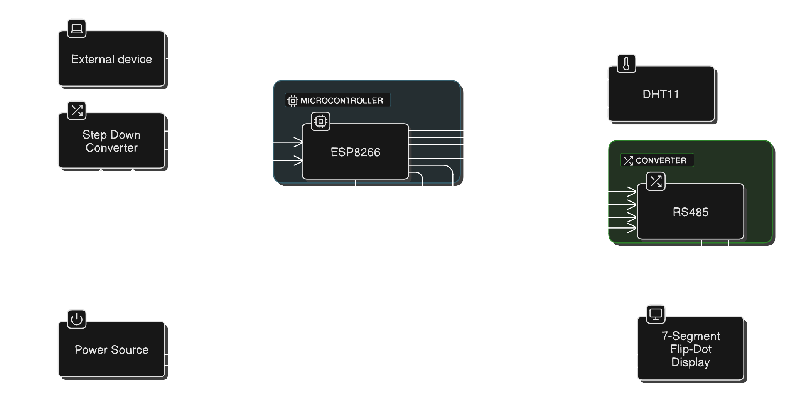

# Hand Gesture Recognition and Display on 7-Segment Flip-Dot Display

## Project Overview
This project implements a system that recognizes hand gestures from American Sign Language (ASL) and displays the corresponding letters on a 7-segment flip-dot display. The system includes three different implementation variants, with the final solution using an ESP8266 as a server that displays recognized gestures sent from a client.

## Video Demo
A demonstration of the project can be viewed here: [YouTube Video](https://www.youtube.com/watch?v=IdzLrns7vJk)



## System Components

### Hardware
- 4×7 segment flip-dot display
- RS-485 converter for communication with the display
- DHT11 temperature and humidity sensor
- ESP8266 microcontroller (final version)
- Raspberry Pi 4 (earlier versions)
- Camera for gesture recognition

### Software
- Neural network model for sign language recognition
- Communication protocol for the flip-dot display
- Server application for the ESP8266
- Client application for gesture recognition

## Implementation Variants

### Variant 1: Raspberry Pi 4 (C + Python)
Located in the `rpi4_py_c` directory. This implementation:
- Uses C for serial communication with the display
- Uses Python for gesture recognition with MediaPipe Hands
- Communicates between components via sockets

### Variant 2: Raspberry Pi 4 (Python Only)
Located in the `rpi4_py_only` directory. This implementation:
- Handles both gesture recognition and display communication in Python
- Directly sends data through the serial port to the display

### Variant 3: ESP8266 + Client (Final Version)
Located in the `esp8266` directory. This implementation:
- Uses an ESP8266 as a server that connects to WiFi
- Handles communication with the display via RS-485
- Displays time, temperature, and humidity when in idle mode
- Accepts gesture data from any client over WiFi
- Shows animated welcome messages and visual feedback

## Machine Learning Model
The gesture recognition model:
- Was trained on ASL hand landmark data extracted using MediaPipe
- Uses 21 3D hand landmarks (63 features) as input
- Classifies 28 output classes (26 letters + delete + space)
- Is implemented using PyTorch

## How to Use

### ESP8266 Server
1. Upload the code in `esp8266/server_gestures` to an ESP8266 device
2. Connect the ESP8266 to the RS-485 converter (TX to D2, RX to D3)
3. Connect the DHT11 sensor to pin D5
4. The server will display the device's IP address on startup

### Client Application
1. Install dependencies: `pip install -r requirements.txt`
2. Set the SERVER_IP and SERVER_PORT in `esp8266/client_gestures/client.py`
3. Run the client application: `python client.py`
4. Make hand gestures in front of the camera to send letters to the display

## Protocol and Communication
The flip-dot display uses a specific data frame format:
```
+-------+----------+---------+----------------+-------+
| 0x80  | Command  | Address |      Data      | 0x8F  |
+-------+----------+---------+----------------+-------+
```
- Header: 0x80
- Command: 0x83 (for 4x7 display)
- Address: 0xFF (broadcast)
- Data: 28 bytes (4 rows × 7 characters)
- Footer: 0x8F

Each character is represented by 7 segments, encoded in a single byte.

## Author
Michal Balogh (xbalog06)